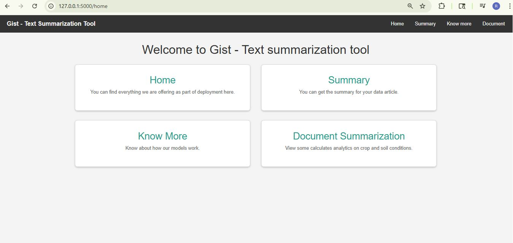
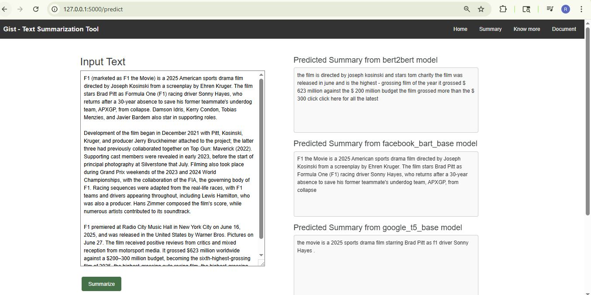

# 📝 Text Summarization with Transformers

A comprehensive **text summarization system** that processes news articles and generates concise summaries using **state-of-the-art transformer models**.

---

## 🚀 Features

- **Data Processing**: Automated extraction and preprocessing of CNN/DailyMail dataset  
- **Transformer Models**: Support for BART, T5, and other Seq2Seq architectures  
- **Training Pipeline**: Complete training loop with validation and checkpointing  
- **Evaluation**: Comprehensive metrics including ROUGE and BLEU scores  
- **Modular Design**: Clean, maintainable code structure with proper testing  

---

## 📁 Project Structure

```
text_summarization/
├── src/ # Source code
│ ├── config.py # Configuration and constants
│ ├── data_loading.py # Dataset loading and extraction
│ ├── preprocessing.py # Text cleaning and tokenization
│ ├── model_training.py # Model initialization and training
│ ├── evaluation.py # Metrics and evaluation
│ └── utils.py # Utility functions
├── tests/ # Unit tests
│ ├── test_data_loading.py
│ ├── test_preprocessing.py
│ ├── test_model_training.py
│ ├── test_evaluation.py
│ └── test_utils.py
├── models/ # Saved model checkpoints
├── results/ # Evaluation results and plots
├── experiments/ # Jupyter notebook experiments
├── data/ # Dataset storage
├── requirements.txt # Python dependencies
├── setup.py # Package installation
└── main.py # Main pipeline script
```
---

## ⚙️ Installation

**Clone the repository:**


```bash
git clone <your-repository-url>
cd text_summarization
```

**Create a virtual environment (recommended):**

```bash
python -m venv venv
source venv/bin/activate  # On Windows: venv\Scripts\activate
```

**Install dependencies:**

```bash
pip install -r requirements.txt
```

**Download NLTK resources (automatically handled):**

```bash
python -c "import nltk; nltk.download('punkt'); nltk.download('stopwords')"
```

## 📊 Dataset

This project uses the CNN/DailyMail dataset for training and evaluation.
The dataset will be automatically downloaded and processed when you run the pipeline.

## Run the Full Pipeline: Extract → Train → Evaluate
```bash
python main.py --extract --train --evaluate
```

## Run Individual Steps
**Extract dataset only**
```bash
python main.py --extract
```

**Train model only (requires extracted data)**
```bash
python main.py --train
```

**Evaluate existing model**
```bash
python main.py --evaluate
```

## 🧪 Testing

Run the test suite to ensure everything works correctly:

**Run all tests**
```bash
pytest
```

**Run specific test module**
```bash
pytest tests/test_preprocessing.py -v
```

**Run with coverage report**
```bash
pytest --cov=src tests/
```

## UI Results
  
